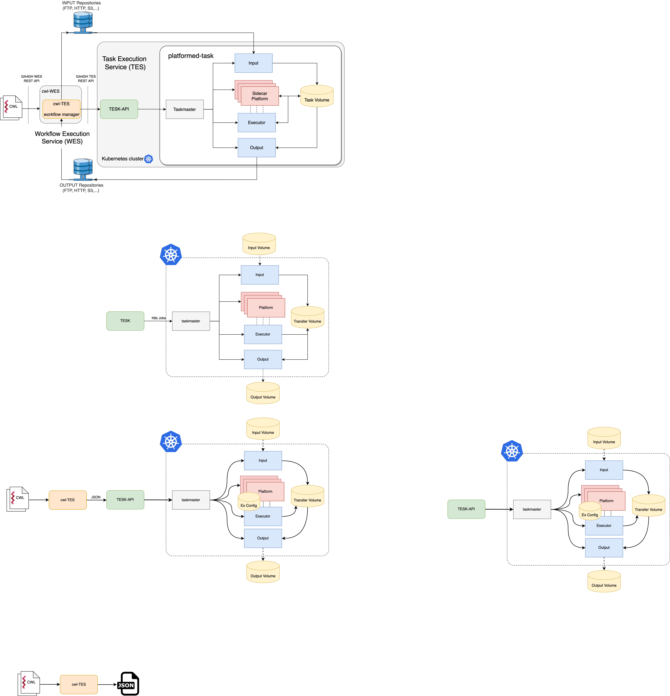
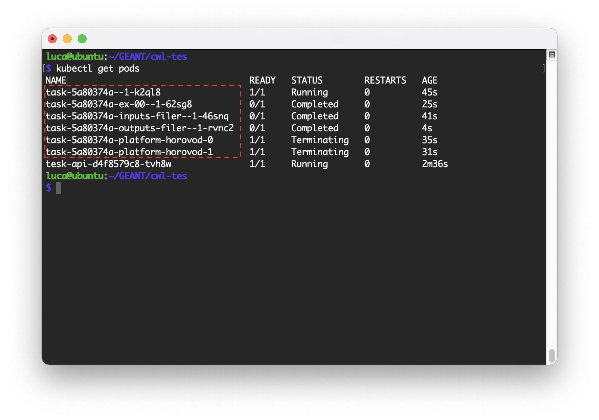

# PLAS - Platformed Workflows (A GCF Extension)


PLAS is a project funded by the [GÉANT Innovation Programme](https://community.geant.org/community-programme-portfolio/innovation-programme/) initiative to extend the [GÉANT Cloud Flow (GCF)](https://clouds.geant.org/community-cloud/) to be capable of performing platformed-tasks in the cloud.

## Introduction

The architecture of the [GÉANT Cloud Flow (GCF)](https://clouds.geant.org/community-cloud/) platform consists of a [Workflow Execution Service (WES)](https://github.com/elixir-cloud-aai/cwl-WES) that receives as input a [CWL](https://github.com/common-workflow-language/common-workflow-language) file, selects the most convenient Container platform from those available, and finally forwards the CWL file to a [CWL Task Execution Service (CWL-TES)](https://github.com/ohsu-comp-bio/cwl-tes) that is running at the selected site. In turn, the CWL-TES transforms the CWL request into a JSON format and sends it to a [TES-API](https://github.com/ga4gh/task-execution-schemas) server. The TES-API leverages an underlying container platform to execute the containers of the tasks that make up the workflow. Therefore, the TES-API is a component whose implementation depends on the local container platform (e.g., Docker Swarm, Kubernetes, etc.). In this project we have considered Kubernetes and the related TES-API called [TESK](https://github.com/elixir-cloud-aai/TESK). 

To execute a containerized-task the TESK-API runs four Pods: a Pod taskmaster with orchestration roles, an Input Pod and an Output Pod to manage the input and output files of the task, and an executor Pod that includes the container with the software of the task to be executed.



We implemented and tested the PLAS platformed-task extension.
The software upgrades are the following:

- We extended the CWL language with a new “HelmRequirement” class to allow the definition of the platform on which to execute platformed-tasks by means of Helm charts.
- We modified the CWL-TES (client) so that the CWL language validator would accept the change and would correctly forward them to the new TESK-API.
- We extended the TESK-API and its taskmaster to properly deploy the Helm platform and an executor Pod that uses it for the analysis task. Upon task completion the deployed components are terminated and removed.
We successfully tested and made available the Helm charts and executors Docker images for platformed-tasks based on Horovod and Apache Spark that can be used for machine learning distributed training tasks.

All the repositories are gathered in the [PlatformedTasks](https://github.com/PlatformedTasks) GitHub organization, and summarized as follows:
- [PLAS-cwl-tes](https://github.com/PlatformedTasks/PLAS-cwl-tes): the extension of the [cwl-tes](https://github.com/ohsu-comp-bio/cwl-tes)
- [PLAS-TESK](https://github.com/PlatformedTasks/PLAS-TESK): the extension of the Elixir's [TESK](https://github.com/elixir-cloud-aai/TESK), as well as their components:
    - [PLAS-tesk-api](https://github.com/PlatformedTasks/PLAS-tesk-api) from the [tesk-api](https://github.com/elixir-cloud-aai/tesk-api)
    - [PLAS-tesk-core](https://github.com/PlatformedTasks/PLAS-tesk-core) from the [tesk-core](https://github.com/elixir-cloud-aai/tesk-core)
- [PLAS-charts](https://github.com/PlatformedTasks/PLAS-charts) which is a collection of the created Helm Charts:
    - Horovod
    - Spark
    - and the already mentioned [PLAS-TESK](https://github.com/PlatformedTasks/PLAS-TESK)

Also, all the used Docker images can be found at the following [DockerHub repository](https://hub.docker.com/u/platformedtasks).

## Setup a PLAS compatible testbed

This is a step by step reference to properly configure a working PLAS compatible testbed:

1. A Kubernetes cluster with version >= v1.21
2. Install an NFS provisioner. We have chosen the NFS Ganesha server as described in the [official guide](https://kubernetes.io/docs/concepts/storage/storage-classes/#nfs). In particular from the [GitHub repository](https://github.com/kubernetes-sigs/nfs-ganesha-server-and-external-provisioner) we have installed only the deployment with its relative RBAC (as the code below shows), while for the storage class will be installed using the Helm Chart of the TESK-API:

```console
$ git clone https://github.com/kubernetes-sigs/nfs-ganesha-server-and-external-provisioner.git
$ cd nfs-ganesha-server-and-external-provisioner/
$ kubectl create -f deploy/kubernetes/deployment.yaml
serviceaccount/nfs-provisioner created
service "nfs-provisioner" created
deployment "nfs-provisioner" created
$ kubectl create -f deploy/kubernetes/rbac.yaml
clusterrole.rbac.authorization.k8s.io/nfs-provisioner-runner created
clusterrolebinding.rbac.authorization.k8s.io/run-nfs-provisioner created
role.rbac.authorization.k8s.io/leader-locking-nfs-provisioner created
rolebinding.rbac.authorization.k8s.io/leader-locking-nfs-provisioner created
```

3. Install and configure an FTP server
4. Install [Helm](https://helm.sh/docs/intro/install/) version >= 3
5. Install [PLAS-TESK](https://github.com/PlatformedTasks/PLAS-TESK)
6. Install [PLAS-cwl-tes](https://github.com/PlatformedTasks/PLAS-cwl-tes)

Now you should have a PLAS compatible testbed ready. Continue reading to try a PLAS example.


## Hands-on example
### Horovod
You need a PLAS compatible testbet to test this example. 
The [following guide](configure_plas_testbed.md) is a step by step reference guide to properly configure a PLAS compatible testbed.

Assuming a testbet up and running, with this example we will run an Horovod platfromed-task, a distributed deep learning tool, in a Kubernetes cluster.

### Steps
First, let's define the platformed-task using a CWL file. The CWL file of the example can be found in the [PLAS-cwl-tes](https://github.com/PlatformedTasks/PLAS-cwl-tes.git) repository as [`PLAS-cwl-tes/tests/helm-horovod.cwl.yml`](https://github.com/PlatformedTasks/PLAS-cwl-tes/blob/main/tests/helm-horovod.cwl.yml).

The core difference introduced with PLAS is how the executor is deployed, instead of being just a single container, it is a container that can take advantage the distributed power of a platform deployed using Helm.

In the following example we use the `HelmRequirement` class we have added to the CWL specification to install the `Horovod` chart using our repository, which can be reached [here](https://github.com/PlatformedTasks/PLAS-charts).
The executor instead, uses a separate image identified by `executorImage`.

Next, we have followed the standard CWL to define the remaining fields.
In particular we have specified two input files `train` and `values`, both located in the tests directory in the tests directory in the [PLAS-cwl-tes](https://github.com/PlatformedTasks/PLAS-cwl-tes/tree/main/tests) GitHub repository. 
The first one is the file passed to the Horovod workers to perform the training while the latter is used to tune the Horovod installation made using Helm.

We have defined the output file and also the command the executor must execute.

Specifically it is a concatenation of the `baseCommand` with its `arguments`. In this case, the first argument is the python script called `horovod-executor.py` and located in the `executorImage` (`platformedtasks/horovod:latest`) and the second argument is the command that the executor will execute.

```yaml
# tests/helm-horovod.cwl.yml
cwlVersion: v1.0
class: CommandLineTool
doc: "helm horovod"
requirements:
  - class: HelmRequirement
    chartRepo: "https://platformedtasks.github.io/PLAS-charts/charts"
    chartName: "horovod"
    chartVersion: "3.0.0"
    executorImage: "platformedtasks/horovod:latest"

inputs:
  - id: train
    type: File
    doc: "original content"
    inputBinding:
      position: 1
  - id: values
    type: File

outputs:
  - id: output
    type: stdout

stdout: horovod

baseCommand: ["python3"]
arguments: ["/horovod/examples/horovod-executor.py", "mpirun -np 2 --mca orte_keep_fqdn_hostnames t --allow-run-as-root --display-map --tag-output --timestamp-output"]
```

To submit the CWL run the following command filled with the addresses of your FTP server and K8s endpoint using [PLAS-cwl-tes](https://github.com/PlatformedTasks/PLAS-cwl-tes.git):

```shell
python3 cwl-tes.py --remote-storage-url ftp://<ftp-server>/files/out --insecure --tes http://<k8s-plas-tesk-api> --leave-outputs tests/helm-horovod.cwl.yml tests/inputs.json
```

The `tests/inputs.json` gathers the input files defined in the CWL and can be seen below. 
As a remark, the `values` files has the field `TMconfig` set as `true` as part of the PLAS implementation and it means that the related file is passed to the taskmaster as a configuration file for the Helm deployment.

Indeed, the `train` file is not meant for the taskmaster, hence the absence of the related flag.

```json
{
    "values": {
        "class": "File",
        "location": "ftp://<ftp-server>/files/horovod-values.yaml",
        "TMconfig": true
    },
    "train": {
        "class": "File",
        "location": "ftp://<ftp-server>/files/train-easy.py"
    }
}
```

As a remark, the `values` files has the field `TMconfig` set as `true` as part of the PLAS implementation and it means that the related file is passed to the taskmaster as a configuration file for the Helm deployment.

Indeed, the `train` file is not meant for the taskmaster, hence the absence of the related flag.




The Figure shows the status of the Pods immediately after the end of a platformed-task that uses a Horovod platform made of two workers. 
We can see the same random prefix (`task-5a80374a`) for all the Pods belonging to the same task. In particular, `task-5a80374a--1-k2ql8` is the taskmaster which initially deploys the input filer Pod (`task-5a80374a-inputs-filer--1-46snq`). The taskmaster installs the Horovod workers (`task-5a80374a-platform-horovod-{0,1}`) and the executor (`task-5a80374a-ex-00--1-62sg8`) that runs its tasks leveraging the Horovod workers. After the task completion, the taskmaster deletes the platform, that’s why the `Terminating` state, while the output Pod (`task-5a80374a-outputs-filer--1-rvnc2`) has saved the results on the appropriate volumes and is marked as `Completed`.

This software is supported by GÉANT Innovation Programme Project.