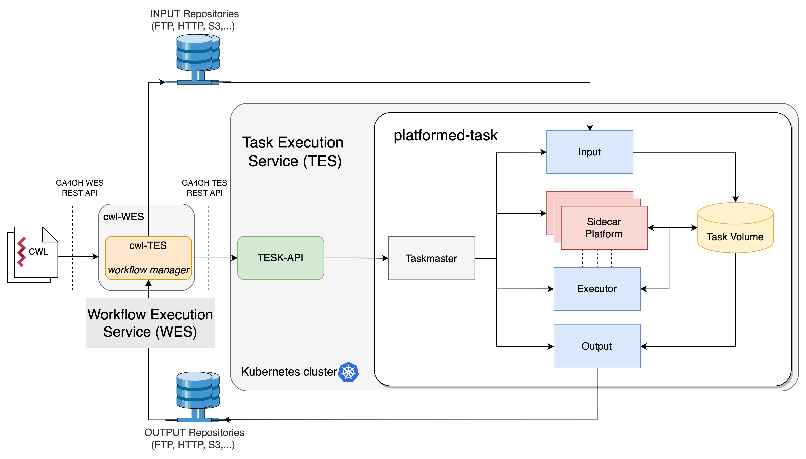

# CWL-PLAS : An extension of CWL for running Platformed Tasks

CWL-PLAS is a project funded by the [GÉANT Innovation Programme](https://community.geant.org/community-programme-portfolio/innovation-programme/) initiative to extend the [GÉANT Cloud Flow (GCF)](https://clouds.geant.org/community-cloud/) workflow execution platform based on CWL language to be capable of running platformed-tasks. The proposed CWL specification extensions are named *CWL-PLAS*, the software in this repository that implement them is named *CWL-PLASK*.

## Introduction

The architecture of the GCF conforms to the: 
- Global Alliance for Genomics and Health (GA4GH) [Workflow Execution Service (WES) API](https://github.com/ga4gh/wiki/wiki/Workflow-Execution-Service)
- Global Alliance for Genomics and Health (GA4GH) [Task Execution Service (WES) API](https://github.com/ga4gh/wiki/wiki/Task-Execution-Service)
- Common Workflow Language [(CWL)](https://www.commonwl.org)

The GCF architecture consists of a Workflow Execution Service (WES) implementation called [cwl-WES](https://github.com/elixir-cloud-aai/cwl-WES) that receives as input a .cwl file describing the workflow and manages its execution using an internal workflow manager called [cwl-TES](https://github.com/ohsu-comp-bio/cwl-tes). The cwl-TES workflow engine requests execution of the tasks that make up the workflow to a remote Task Execution Service (TES). 

There are several implementations of a TES, and CWL-PLAS uses one called [TESK](https://github.com/elixir-cloud-aai/TESK) that leverages a Kubernetes cluster. The TESK architecture consists of a TESK-API server that receives requests from the upstream cwl-TES and distributes the Kubernetes resources needed to execute the task. 

To execute a *legacy* task, TESK-API runs a Kubernetes Job (see note), named  `Taskmaster`, which orchestrates the execution of the task. 
The Taskmaster executes three Jobs: an input Job and an output Job to manage, respectively, the input and output files of the task, and an execution Job that includes the container with the software running the task. The Jobs exchange files through a Task-Volume instantiated by the Taskmaster. When the Jobs finish, Kubernetes resources are released.

> **_Kubernetes Job_**: differently from a plain Kubernetes Pod that is intended to execute a long-term service, a Job is a Pod designed to reliably execute a short-term software program within a Container. When the program is completed, the Job terminates and Kubernetes keeps track of successful completions
 
## CWL-PLAS Specification Extension

CWL-PLAS extends CWL by introducing the *platformed-task* model. A platformed task is a task whose execution is *accelerated* by a parallel computing sidecar platform. For example, a machine learning task can be assisted by a multi-container sidecar platform such as [Horovod](https://github.com/horovod) that parallelizes neural network training.  With CWL-PLAS, we move from a single-container-per-task model of the legacy CWL to a multi-container-per-task model.

Currently, CWL-PLAS considers sidecar platforms described by [Helm](https://helm.sh/) charts so that implementations using Kubernetes clusters can use Helm to install the sidecar platform along with other Kubernetes resources needed for the task.

In terms of specifications, CWL-PLAS extends:
- The [CWL Command Line Tool Description](https://www.commonwl.org/v1.0/CommandLineTool.html)
- The [Task Execution Service (TES) APIs](https://github.com/ga4gh/wiki/wiki/Task-Execution-Service)

### Extension of the CWL Command Line Tool Description
CWL-PLAS introduces a new `HelmRequirement` that a CommandLineTool can list under `requirements`. The  `HelmRequirement` fields indicate that a task requires a sidecar Helm-based multi-container environment and specifies how to retrieve the related Helm platform.
The command-line tool run to perform the task activity must be contained in a `Executor` Container, specified by the legacy `DockerRequirement`.

| **field** | **required** | **type** | **value**                                                                           |
|----------------|--------------|----------|--------------------------------------------------------------------------------|
| class          | required     | string   | Always 'HelmRequirement'                                                       |
| chartRepo      | required     | string   | URL of the Helm Repository of the platformchart                                |
| chartName      | required     | string   | Name of the chart                                                              |
| chartVersion   | required     | string   | Chart version                                                                  |
| chartValues    | optional     | string   | URL of chart .yml  values (backend can ignore and use chart default)           |


### Extension of the Task Execution Service (TES) APIs
CWL-PLAS introduces a new possible property in the `tesExecutor`  object named `sidecar` that is an  object whose schema is the following:

| **field**     | **required** | **type**    | **value**                                                                    |
|---------------|--------------|-------------|------------------------------------------------------------------------------|
| type          | required     | string      | Only 'Helm' corrently supported                                              |
| parameters    | required     | JSON Object | parameters of the specific sidecar platform                                  |

For the case of `type: Helm` the `parameters` object is the following

| **field**     | **required** | **type** | **value**                                                                      |
|---------------|--------------|----------|--------------------------------------------------------------------------------|
| chartName     | required     | string   | Name of the chart                                                              |
| chartVersion  | required     | string   | Chart version                                                                  |
| chartValues   | optional     | string   | URL of chart .yml  values (backend can ignore and use chart default)           |                                                     |


## CWL-PLASK



CWL-PLASK is an implementation of CWL-PLAS specification that uses a Kubernetes cluster as a cloud backend. It is an upgrade of the GCF architecture. Specifically, 

- a new workflow manager `cwl-TES`  that accepts the CWL-PLAS extensions to CWL language and TES API. 
- a new `TESK-API` and `Taskmaster` of TESK-CORE to properly deploy the Executor Container and the sidecar platform through Helm. Upon task completion, the sidecar platform is terminated and removed. Therefore, the platform lifecicle is boud with those of the task.

We successfully tested and made available the Helm charts and Executors Docker images for platformed-tasks based on Horovod and Apache Spark that can be used for machine learning distributed training tasks.

All the repositories are gathered in the [PlatformedTasks](https://github.com/PlatformedTasks) GitHub organization, and summarized as follows:
- [PLAS-cwl-tes](https://github.com/PlatformedTasks/PLAS-cwl-tes): the extension of the [cwl-tes](https://github.com/ohsu-comp-bio/cwl-tes)
- [PLAS-TESK](https://github.com/PlatformedTasks/PLAS-TESK): the extension of the Elixir's [TESK](https://github.com/elixir-cloud-aai/TESK), as well as their components:
    - [PLAS-tesk-api](https://github.com/PlatformedTasks/PLAS-tesk-api) from the [tesk-api](https://github.com/elixir-cloud-aai/tesk-api)
    - [PLAS-tesk-core](https://github.com/PlatformedTasks/PLAS-tesk-core) from the [tesk-core](https://github.com/elixir-cloud-aai/tesk-core)
- [PLAS-charts](https://github.com/PlatformedTasks/PLAS-charts) which is a collection of our supported Helm Charts:
    - Horovod
    - Spark
    - and the already mentioned [PLAS-TESK](https://github.com/PlatformedTasks/PLAS-TESK)

Also, all the used Docker images can be found at the following [DockerHub repository](https://hub.docker.com/u/platformedtasks).

## Setup a CWL-PLASK testbed
This is a step-by-step reference to properly configure a working CWL-PLASK testbed:

1. A Kubernetes cluster with version >= v1.21
2. Install an NFS provisioner. 
  We have chosen the NFS Ganesha server as described in the [official guide](https://kubernetes.io/docs/concepts/storage/storage-classes/#nfs). 
  In particular from the [GitHub repository](https://github.com/kubernetes-sigs/nfs-ganesha-server-and-external-provisioner) we have installed only the deployment with its relative RBAC (as the code below shows), while for the storage class will be installed using the Helm Chart of the TESK-API:

```console
$ git clone https://github.com/kubernetes-sigs/nfs-ganesha-server-and-external-provisioner.git
$ cd nfs-ganesha-server-and-external-provisioner/
$ kubectl create -f deploy/kubernetes/deployment.yaml
serviceaccount/nfs-provisioner created
service "nfs-provisioner" created
deployment "nfs-provisioner" created
$ kubectl create -f deploy/kubernetes/rbac.yaml
clusterrole.rbac.authorization.k8s.io/nfs-provisioner-runner created
clusterrolebinding.rbac.authorization.k8s.io/run-nfs-provisioner created
role.rbac.authorization.k8s.io/leader-locking-nfs-provisioner created
rolebinding.rbac.authorization.k8s.io/leader-locking-nfs-provisioner created
```

3. Create a `PersistentVolumeClaim`, in our case it will be called `transfer-pvc` and the `StorageClassName`: `example-nfs`.
```bash
cat <<EOF | kubectl apply -f -
apiVersion: v1
kind: PersistentVolumeClaim
metadata:
  name: transfer-pvc
  namespace: default
spec:
  accessModes:
    - ReadWriteMany
  storageClassName: example-nfs
  resources:
    requests:
      storage: 200Mi # choose a storage size
EOF
```

4. Install and configure an FTP server. The configuration we have used for the tests is [the following](./fpt_config.md).
4. Install [Helm](https://helm.sh/docs/intro/install/) version >= 3
5. Install [PLAS-TESK](https://github.com/PlatformedTasks/PLAS-TESK)
6. Install [PLAS-cwl-tes](https://github.com/PlatformedTasks/PLAS-cwl-tes)

Now you should have a PLAS compatible testbed ready, continue reading to deploy an example [using Horovod](#deploy-a-platformed-task-using-horovod) or using [Apache Spark](#deploy-a-platformed-task-using-spark).


## Hands-On Examples
### Run a Horovod accelerated Machine Learning Platformed-Task  

<p align="center">
  
</p>

#### 1. CWL Definition
First, let's define the platformed-task using a .cwl file like the following [one](https://github.com/PlatformedTasks/PLAS-cwl-tes/blob/main/tests/helm-horovod.cwl.yml).

```yaml
# tests/helm-horovod.cwl.yml
cwlVersion: v1.0
class: CommandLineTool
doc: "helm horovod"
requirements:
  - class: DockerRequirement
    dockerPull: "platformedtasks/horovod:latest"
  - class: HelmRequirement
    chartRepo: "https://platformedtasks.github.io/PLAS-charts/charts"
    chartName: "horovod"
    chartVersion: "3.0.0"

inputs:
  - id: np
    type: int
    doc: "number of processes"
    inputBinding:
      position: 1
  - id: train
    type: File
    doc: "python training script"
    inputBinding:
      position: 2

outputs:
  - id: output
    type: stdout

stdout: horovod

baseCommand: ["python3"]
arguments: ["/horovod/examples/horovod-exec.py"]
```

In this example, we use the `HelmRequirement` class to install the `Horovod` chart using our [repository](https://github.com/PlatformedTasks/PLAS-charts). The Executor Container instead, uses a separate image specified by `DockerRequirement` field.

Next, we have defined the input `train`, whose URI is specified by the following [input.json](https://github.com/PlatformedTasks/PLAS-cwl-tes/tree/main/tests/inputs.json) file.

```json
{
    "train": {
        "class": "File",
        "location": "ftp://<ftp-server>/files/train-easy.py"
    },
    "np": 2
}
```

We have defined an output file named  `horovod` that is the dump of the stdout produced by the execution of the task. 

In this example, the Executor is a Container that runs the command  
```zsh
python3 /horovod/examples/horovod-exec.py 2 <path-of-train-file>
```

#### 2. Task Run 
We used our `cwl-TES ` command-line tool to run a platformed-task as follows.

```zsh
python3 cwl-tes.py --remote-storage-url ftp://<ftp-server>/files/out --insecure --tes http://<k8s-plas-tesk-api> --leave-outputs tests/helm-horovod.cwl.yml tests/inputs.json
```

The Figure shows the status of the Kubernetes Jobs immediately after the end of the Horovod platformed-task.


We can see the same random prefix (`task-5a80374a`) for all the Pods belonging to the same task. In particular, `task-5a80374a--1-k2ql8` is the Taskmaster which initially runs the Input (filer) Jobs (`task-5a80374a-inputs-filer--1-46snq`). Then, the Taskmaster installs the Horovod sidecar platform (`task-5a80374a-platform-horovod-{0,1}`) and the Executor (`task-5a80374a-ex-00--1-62sg8`) that runs its tasks leveraging the Horovod workers. After the task completion, the Taskmaster deletes the platform, that’s why the `Terminating` state, while the Output Job (`task-5a80374a-outputs-filer--1-rvnc2`) has saved the results on the appropriate volumes and is marked as `Completed`.


### Run a Spark accelerated Machine Learning Platformed-Task
In this second example, we will deploy a platformed-task using Apache Spark. 
The procedure is the same as the one using Horovod.

#### 1. CWL Definition
First, let's define the CWL with the description of the platformed task in the CWL format.
As for the Horovod version, the following .cwl file can be found in the [PLAS-cwl-tes](https://github.com/PlatformedTasks/PLAS-cwl-tes.git) repository as [`PLAS-cwl-tes/tests/helm-spark.cwl.yml`](https://github.com/PlatformedTasks/PLAS-cwl-tes/blob/main/tests/helm-spark.cwl.yml):

```yaml
# tests/helm-spark.cwl.yml
cwlVersion: v1.0
class: CommandLineTool
doc: "helm spark"
requirementds:
  - class: DockerRequirement
    dockerPull: "platformedtasks/spark:latest"
  - class: HelmRequirement
    chartRepo: "https://platformedtasks.github.io/PLAS-charts/charts"
    chartVersion: "6.0.0"
    chartName: "spark"

inputs:
  - id: spark_example
    type: File
    doc: "original content"
    inputBinding:
      position: 1

outputs:
  - id: output
    type: stdout

stdout: spark

baseCommand: ["python3"]
arguments: ["/opt/bitnami/spark/examples/spark-executor.py", "spark-submit --conf=spark.jars.ivy=/tmp/.ivy --class=org.apache.spark.examples.SparkPi --deploy-mode=cluster"]

```

#### 2. Task Run 

```zsh
python3 cwl-tes.py --remote-storage-url ftp://<ftp-server>/files/out --insecure --tes http://<k8s-plas-tesk-api> --leave-outputs tests/helm-spark.cwl.yml tests/inputs.json
```

The deployment of the platformed task can be visualized using the 
Kubernetes command: `kubectl get pods`.


